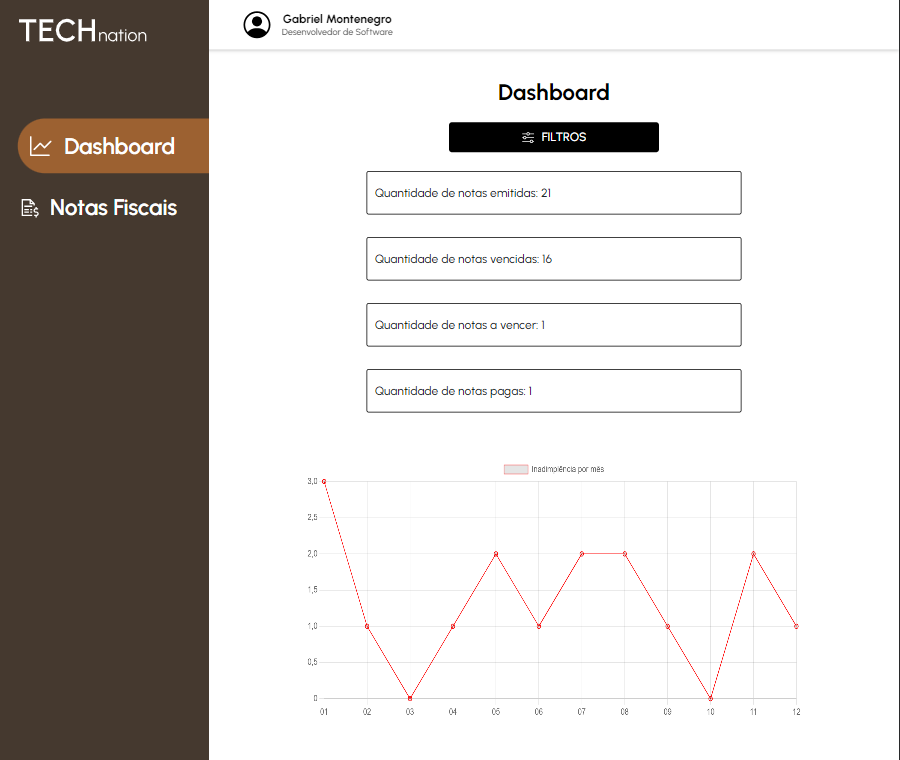
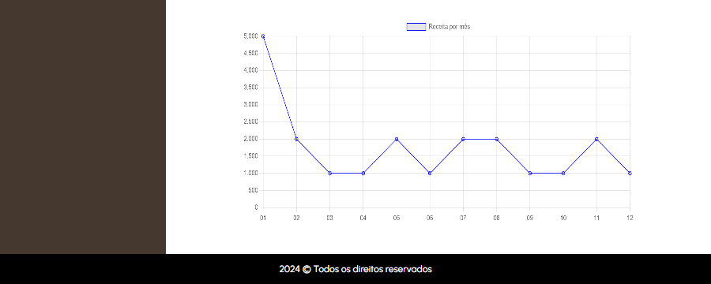
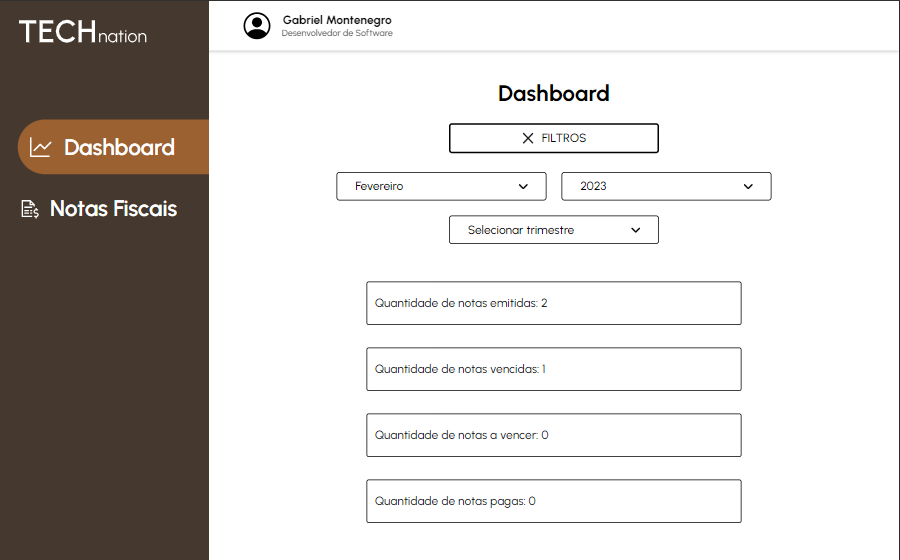
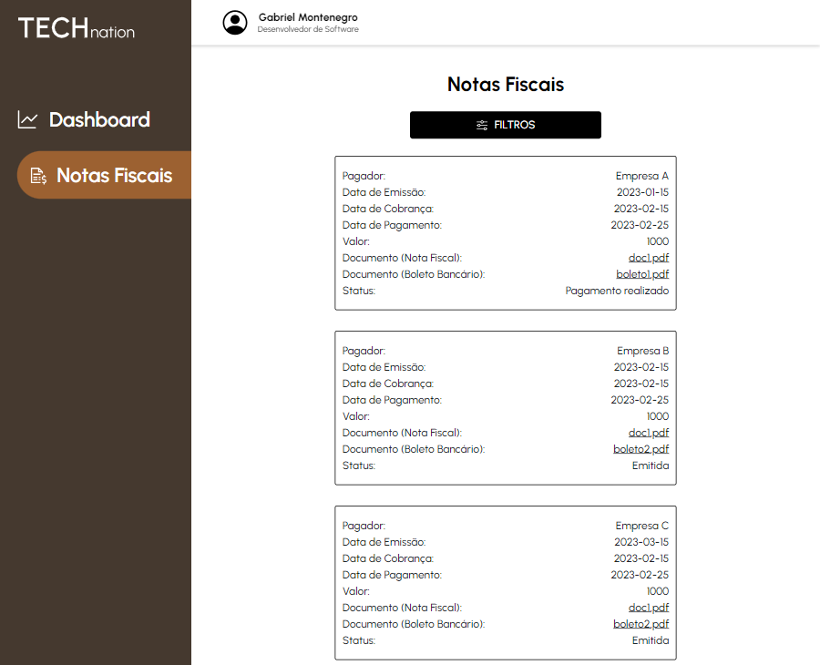
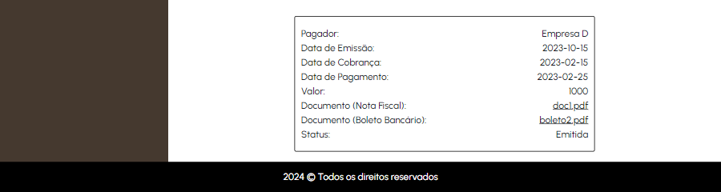
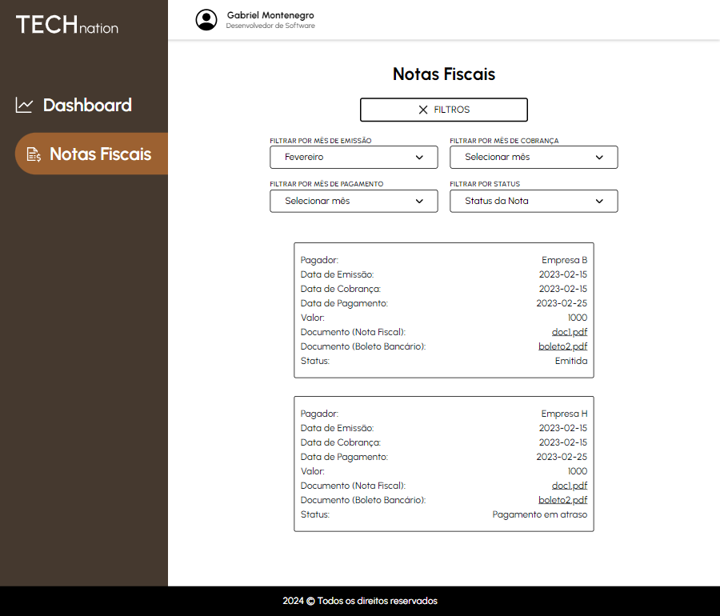
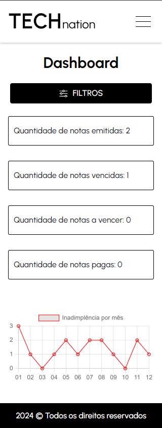
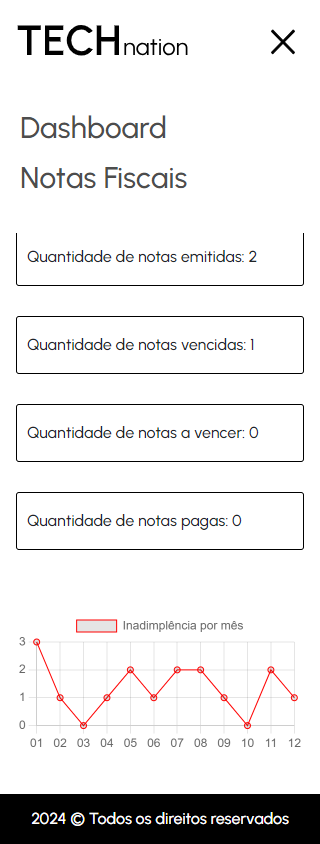

# Technation


## Seções do projeto

-   [Descrição do Projeto](#descrição-do-projeto)
-   [Funcionalidades](#funcionalidades)
-   [Tecnologias](#tecnologias)
-   [Serviços utilizados](#serviços-utilizados)
-   [Link úteis](#links-úteis)
-   [Como rodar o Projeto](#como-rodar-o-projeto)
-   [Autor do projeto](#autor-do-projeto)

## Descrição do projeto

<p>Technation é um sistema financeiro que exibe as informações a respeito das notas fiscais da empresa.</p>
<p>A aplicação possui 2 telas: Dashboard e Nota Fiscal. Ambas possuem filtros específicos para facilitar a visualização mês a mes. Na dashboard possuem filtros de trimestre e ano também.</p>
<p>Página Dashboard: É possível visualizar um panorama geral da quantidade de notas de acordo com a situação. Também possui 2 gráficos, o 1º mostra a evolução da inadimplência mês a mês, já o 2º mostra a evolução da receita recebida mês a mês.</p>
<p>Página Notas fiscais: É possível visualizar todas as notas fiscais e filtrar de diversas formas.</p>

## Funcionalidades

### 1 - Página de Dashboard




### 2 - Filtros Dashboard



### 3 - Página de Notas Fiscais




### 4 - Filtros Notas Fiscais



### 5 - Versão Mobile (Dashboard)



### 6 - Menu Mobile



## Tecnologias

-   `HTML5`
-   `CSS3`
-   `Javascript`
-   `jQuery 3.5`
-   `Bootstrap 4`
-   `Chart.js`
-   `Git Flow`

## Serviços utilizados

-   `Figma`
-   `Github`
-   `Github Pages`
-   `VScode`
-   `Trello`

## Links Úteis

-   Deploy: https://isgabriel.github.io/teste-tecnico-frontend-technation/
-   Figma (protótipo): https://www.figma.com/file/YP2iTKQw41O2vtWcsxhrJu/Technation?type=design&node-id=1%3A10&mode=design&t=29uJX2Nyy6jFhHXd-1

## Como rodar o projeto

Para rodar o projeto em sua máquina, siga estas etapas:

-   Clone o repositório:
    -   Abra o terminal do Git e digite:
        ```
        git clone git@github.com:isgabriel/teste-tecnico-frontend-technation.git
        ```
-   Abra o arquivo `index.html` em seu navegador. O projeto já estará funcionando!!
-   Caso deseje visualizar o código, basta abrir no VScode ou na IDE de sua preferência.

## Autor do projeto

<table>
  <tr>
    <td align="center">
      <a href="http://github.com/isgabriel">
        <br>
        <sub>
          <b>Gabriel Montenegro</b>
        </sub>
      </a>
    </td>
  </tr>
</table>

[⬆ Voltar ao topo](#technation)<br>
